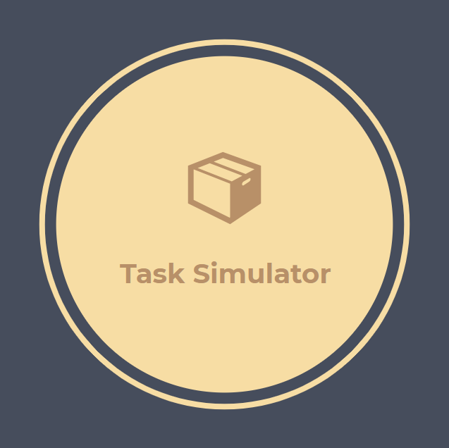

#
Herramienta que busca simular la ejecucion de tareas dentro de un equipo de trabajo para luego tomar decisiones de negocio en base a metricas y resultados.


## Para empezar

Clonar el proyecto de git o descargar en archivo .zip/.tar.gz y descomprimir


## Prerrequisitos

* Python 3.6.8 o superior

## Configuracion

En la carpeta **./config** se encuentran los archivos en los cuales se puede configurar tanto las fdps como las variables de control,unidades de trabajo,metricas,etc.

## Despliegue

En primera instancia es necesario tener las dependencias instaladas, estas se instalan de la sig. manera:
```
pip install -r requirements.txt
```

Para levantar el proyecto solo es necesario ejecutar:
```
python app.py
```
